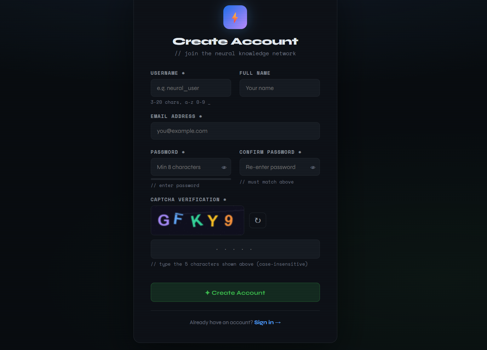
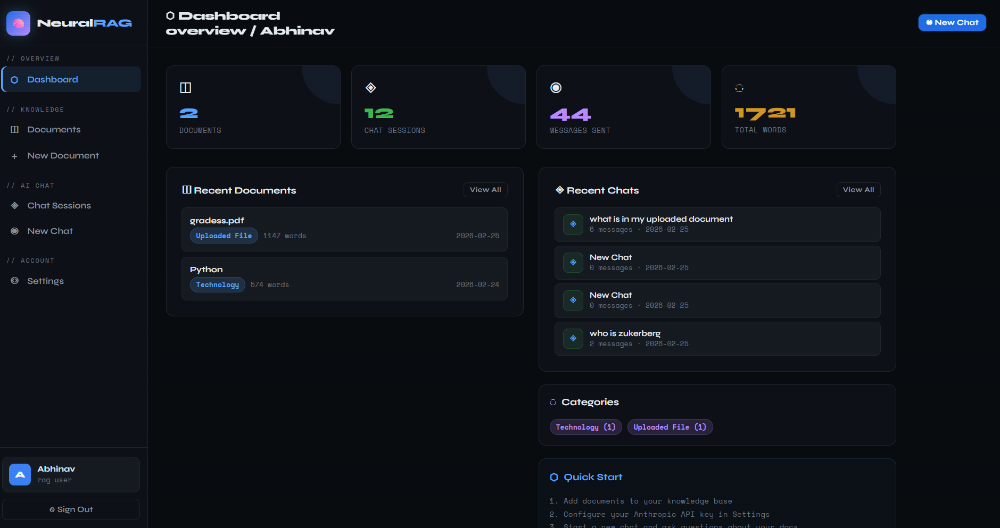
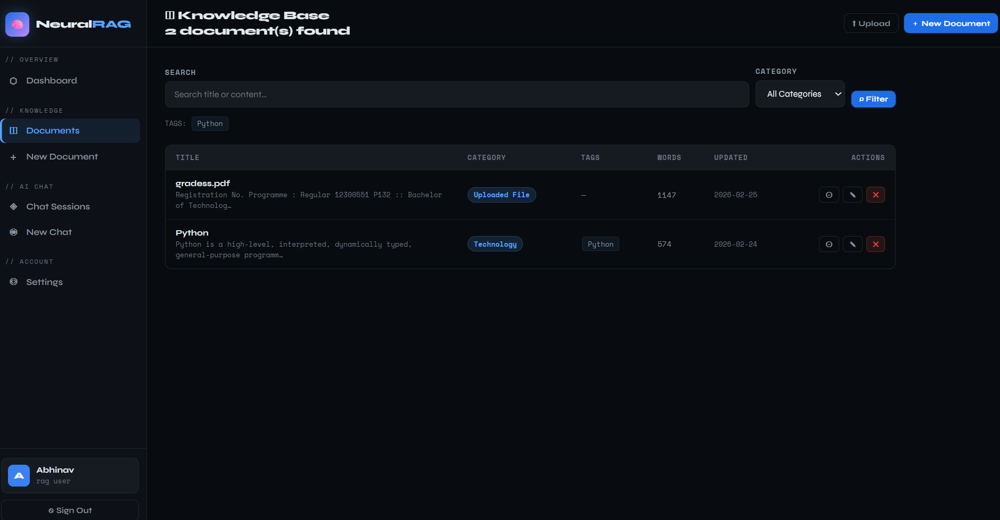
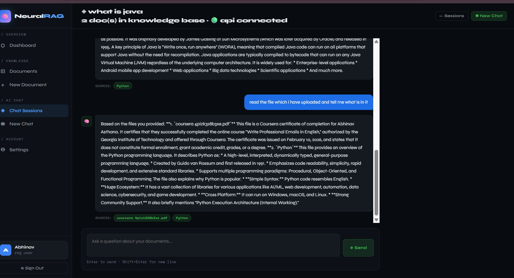
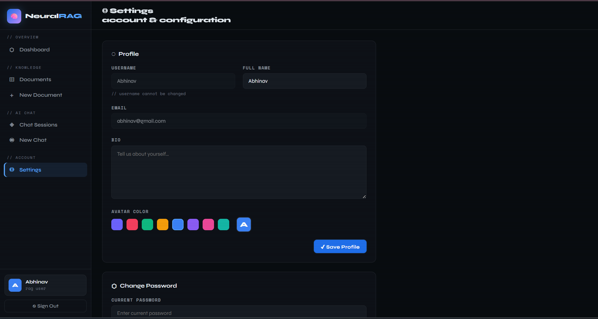
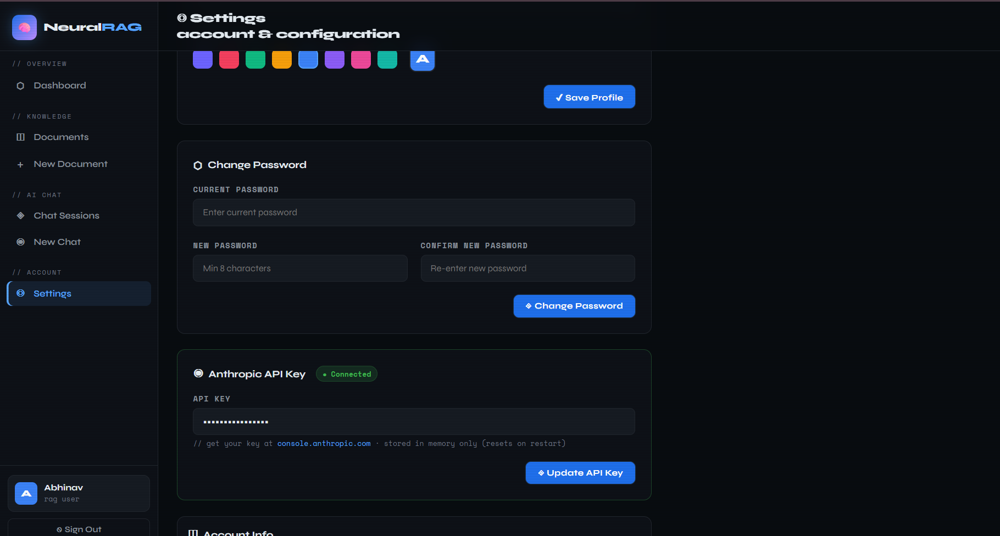

# 🧠 NeuralRAG — Flask RAG LLM Application

A full-stack web application that lets you **chat with your own documents** using Google Gemini AI.
Upload PDFs or Word files, build a personal knowledge base, and get intelligent AI-powered answers.

---

## 🔍 What It Does

NeuralRAG uses **Retrieval-Augmented Generation (RAG)** — instead of asking AI questions blindly,
it first finds the most relevant documents from your knowledge base, then sends that context along
with your question to Gemini AI. Answers are grounded in *your* content.

## 📸 Screenshots

### 🔐 Signup Page


### 📊 Dashboard


### 📄 Documents Page


### 💬 Chat Session


### ⚙️ Settings



**Simple flow:**

```
You ask a question
       ↓
App finds top relevant docs  (TF-IDF similarity)
       ↓
Docs + Question → Gemini AI
       ↓
Smart, context-aware answer ✅
```

---

## ⚡ Features

### 🔐 Authentication
- Secure **Register & Login** system
- Passwords hashed with **PBKDF2-SHA256** (200,000 iterations + random salt)
- Sessions expire after 24 hours

### 🖼️ Image CAPTCHA
- Custom-built CAPTCHA using **PIL (Pillow)**
- Colorful bold characters on dark background with slight rotation
- Refresh button — click image or ↻ to get a new one
- Present on both Register and Login pages

### 📄 Knowledge Base (Documents)
- **Create** documents manually with title, content, category, and tags
- **Edit & Delete** anytime
- **Search** by keyword, filter by category or tag
- Word count tracked per document

### ⬆️ File Upload
- Upload **PDF** or **DOCX** files directly
- Text auto-extracted using `PyPDF2` and `python-docx`
- Saved instantly to your knowledge base, ready for chat

### 🤖 RAG-Powered Chat
- Multiple **chat sessions** — each saved with full history
- Custom **TF-IDF + Cosine Similarity** engine retrieves top-4 relevant docs
- Responses powered by **Google Gemini 2.5 Flash**
- **Demo mode** — app works without API key (shows mock responses)
- Source documents referenced alongside each AI answer

### ⚙️ Settings
- Update profile (name, bio, avatar color)
- Change password securely
- Set or update Gemini API key directly from the UI

### 🌙 UI
- Sleek dark-themed interface
- Fully responsive layout with sidebar navigation

---

## 📦 Installation

### 1. Clone the repo

```bash
git clone https://github.com/yourusername/neuralrag.git
cd neuralrag
```

### 2. Create virtual environment

```bash
python -m venv .venv

# Windows
.venv\Scripts\activate

# Linux / Mac
source .venv/bin/activate
```

### 3. Install dependencies

```bash
pip install flask python-dotenv Pillow PyPDF2 python-docx google-generativeai
```

### 4. Create `.env` file

In the project root folder (same level as `app.py`):

```env
GEMINI_API_KEY=your_gemini_api_key_here
SECRET_KEY=any_random_secret_string
```

> Get your free Gemini API key at: https://aistudio.google.com/app/apikey

### 5. Run

```bash
python app.py
```

Open in browser: **http://127.0.0.1:5000**

---

## 🛠️ Tech Stack

| Layer | Technology |
|-------|------------|
| Backend | Python, Flask |
| Database | SQLite (auto-created, no setup needed) |
| AI Model | Google Gemini 2.5 Flash |
| RAG Engine | Custom TF-IDF + Cosine Similarity |
| CAPTCHA | PIL / Pillow |
| File Parsing | PyPDF2, python-docx |
| Frontend | Jinja2 Templates, Vanilla JS |

---

## 📁 Project Structure

```
neuralrag/
│
├── app.py                    # Core app — routes, RAG engine, CAPTCHA generator
├── .env                      # API keys — DO NOT commit this file
├── .gitignore
├── requirements.txt
│
├── instance/
│   └── app.db                # SQLite database (auto-created on first run)
│
├── uploads/                  # Uploaded PDF/DOCX files stored here
│
└── templates/
    ├── base.html             # Base layout — sidebar, navigation
    ├── login.html            # Login page with CAPTCHA
    ├── register.html         # Register page with CAPTCHA + password strength
    ├── dashboard.html        # Overview — stats, recent docs, recent chats
    ├── documents.html        # Document list with search & filters
    ├── doc_form.html         # Create / Edit document form
    ├── doc_view.html         # View single document
    ├── doc_upload.html       # PDF / DOCX upload page
    ├── chat_list.html        # All chat sessions
    ├── chat_session.html     # Live chat interface with AI
    └── settings.html         # Profile, password, API key management
```

---

## 🔒 Security Notes

Never commit your `.env` file. Add this to `.gitignore`:

```
.env
instance/
uploads/
__pycache__/
.venv/
```

---

## ❗ Common Issues

**"Demo Mode" showing even after adding API key**
→ Make sure `.env` file is in the same folder as `app.py` and restart the server

**CAPTCHA characters appear very small**
→ Add Windows font path in `app.py` — `C:/Windows/Fonts/arialbd.ttf` to `_FONT_CANDIDATES`

**"Could not extract text from file"**
→ The PDF might be scanned/image-based — use a text-based PDF instead
